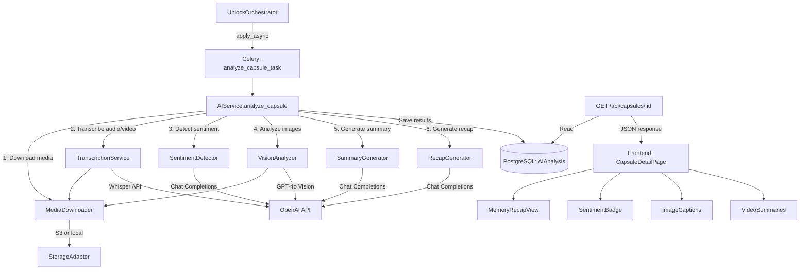

# Design Document: AI Memory Enrichment

## Overview

This feature fixes the existing broken AI services and expands them to provide rich memory enrichment for TimeLock capsules. The current codebase has scaffolded but non-functional AI code: `SummaryGenerator` uses the deprecated `openai.ChatCompletion.create()` API, and `TranscriptionService` tries to open S3 URLs as local file paths. This design addresses those bugs and adds sentiment detection, image analysis, video processing, and a unified memory recap.

The system processes capsules asynchronously via Celery after unlock. Each analysis step (transcription, sentiment, image tagging, summary, recap) is isolated so individual failures don't block others. Results are stored in an expanded `AIAnalysis` model and served through the existing capsule API endpoint. The frontend displays a rich "memory recap" experience with sentiment badges, image captions/tags, and video summaries.

### Key Design Decisions

1. **Fix-first approach**: Migrate `SummaryGenerator` to OpenAI v1.x SDK (`client.chat.completions.create()`) and fix `TranscriptionService` to download from S3 before calling Whisper.
2. **Single AIAnalysis record per capsule**: All enrichment data lives in one row, updated incrementally as each step completes.
3. **Error isolation**: Each analysis step runs in a try/except block. Partial results are saved. Only catastrophic errors (DB failure) mark the record as "failed".
4. **Media download utility**: A new `MediaDownloader` class handles S3 download to temp files with cleanup, reused by transcription and vision services.
5. **GPT-4o for vision**: Image analysis uses GPT-4o with base64-encoded images via the Chat Completions API.
6. **Structured JSON responses**: Sentiment detection and image analysis use `response_format` or prompt engineering to return parseable JSON.

## Architecture



### Processing Pipeline

The AI_Service orchestrates analysis in a fixed order, each step isolated:

1. **Media Download & Transcription** — Download audio/video from S3, transcribe via Whisper
2. **Sentiment Detection** — Analyze text content for emotional tone
3. **Image Analysis** — Download images from S3, analyze via GPT-4o Vision
4. **Summary Generation** — Generate text summary with temporal context
5. **Recap Generation** — Combine all insights into a narrative recap

Each step writes partial results to the `AIAnalysis` record. The `processing_status` transitions: `pending` → `processing` → `completed` (or `failed` on catastrophic error).

## Components and Interfaces

### Backend Services

#### MediaDownloader (NEW)
```python
class MediaDownloader:
    """Downloads media from S3 (or local storage) to temporary files."""
    
    def __init__(self):
        self.storage = StorageAdapter()
    
    def download_to_temp(self, media_url: str) -> str:
        """
        Downloads media file to a temporary path.
        Returns: path to temp file.
        Raises: MediaDownloadError on failure.
        """
        ...
    
    def cleanup(self, temp_path: str) -> None:
        """Deletes temporary file. Logs but doesn't raise on failure."""
        ...
```

#### TranscriptionService (FIX)
```python
class TranscriptionService:
    """Transcribes audio/video using OpenAI Whisper API."""
    
    def __init__(self):
        self.client = OpenAI(api_key=settings.OPENAI_API_KEY)
        self.downloader = MediaDownloader()
    
    def transcribe_media(self, media_url: str, media_type: str, max_retries: int = 3) -> Optional[str]:
        """
        Downloads media from S3, transcribes via Whisper, cleans up temp file.
        Returns transcription text or None on failure.
        """
        ...
```

Key fix: Replace `open(media_url, "rb")` with `self.downloader.download_to_temp(media_url)` followed by `open(temp_path, "rb")`, with cleanup in a `finally` block.

#### SummaryGenerator (FIX)
```python
class SummaryGenerator:
    """Generates summaries using OpenAI Chat Completions API (v1.x)."""
    
    def __init__(self):
        self.client = OpenAI(api_key=settings.OPENAI_API_KEY)
    
    def generate_summary(self, text_content: str, transcriptions: List[str],
                         created_at: datetime, unlocked_at: datetime,
                         max_retries: int = 3) -> Optional[str]:
        """
        Generates a ≤200 word summary using client.chat.completions.create().
        Retries up to max_retries with exponential backoff.
        """
        ...
```

Key fix: Replace `openai.ChatCompletion.create()` with `self.client.chat.completions.create()`. Replace `openai.error.APIError` with `openai.APIError`.

#### SentimentDetector (NEW)
```python
class SentimentDetector:
    """Detects sentiment and tone using OpenAI Chat Completions API."""
    
    VALID_LABELS = ["joyful", "nostalgic", "hopeful", "reflective", 
                    "anxious", "sad", "excited", "neutral"]
    
    def __init__(self):
        self.client = OpenAI(api_key=settings.OPENAI_API_KEY)
    
    def detect_sentiment(self, text: str) -> dict:
        """
        Returns: {"label": str, "confidence": float, "tone_description": str}
        On failure returns: {"label": "neutral", "confidence": 0.0, "tone_description": ""}
        """
        ...
```

Uses a prompt requesting JSON output with `label`, `confidence`, and `tone_description` fields. Validates `label` against `VALID_LABELS`.

#### VisionAnalyzer (NEW)
```python
class VisionAnalyzer:
    """Analyzes images using OpenAI GPT-4o Vision API."""
    
    def __init__(self):
        self.client = OpenAI(api_key=settings.OPENAI_API_KEY)
        self.downloader = MediaDownloader()
    
    def analyze_image(self, media_url: str) -> Optional[dict]:
        """
        Downloads image, encodes as base64, sends to GPT-4o.
        Returns: {"media_url": str, "caption": str, "tags": List[str]} or None.
        """
        ...
    
    def analyze_images(self, media_urls: List[str]) -> List[dict]:
        """Analyzes multiple images. Skips failures, returns partial results."""
        ...
```

#### RecapGenerator (NEW)
```python
class RecapGenerator:
    """Generates unified memory recap combining all AI insights."""
    
    def __init__(self):
        self.client = OpenAI(api_key=settings.OPENAI_API_KEY)
    
    def generate_recap(self, summary: Optional[str], sentiment: Optional[dict],
                       image_analyses: Optional[List[dict]], 
                       video_summaries: Optional[List[dict]],
                       created_at: datetime, unlocked_at: datetime) -> Optional[str]:
        """
        Generates 150-300 word narrative recap. Returns None if no insights available.
        """
        ...
```

#### AIService (REWRITE)
```python
class AIService:
    """Orchestrator for all AI analysis operations."""
    
    def __init__(self):
        self.transcription_service = TranscriptionService()
        self.summary_generator = SummaryGenerator()
        self.sentiment_detector = SentimentDetector()
        self.vision_analyzer = VisionAnalyzer()
        self.recap_generator = RecapGenerator()
    
    def analyze_capsule(self, capsule_id: int, db: Session) -> Optional[AIAnalysis]:
        """
        Full analysis pipeline with error isolation.
        Creates AIAnalysis record upfront (pending), updates incrementally,
        marks completed when done.
        """
        ...
```

### Frontend Components

#### MemoryRecapView (NEW)
```typescript
interface MemoryRecapViewProps {
  recapText: string;
  sentimentLabel?: string | null;
}
```
Displays the recap in a gradient card. Shown as the first section on the unlocked capsule page.

#### SentimentBadge (NEW)
```typescript
interface SentimentBadgeProps {
  label: string;
  confidence: number;
  toneDescription: string;
}
```
Pill-shaped badge with emoji and color mapped to sentiment label.

#### ImageCaptions (ENHANCEMENT)
Extends existing image display to show AI caption below each image and tags as pill badges.

#### VideoSummaries (ENHANCEMENT)
Extends existing video player to show AI-generated summary below each video.

#### AIProcessingIndicator (NEW)
```typescript
interface AIProcessingIndicatorProps {
  status: "pending" | "processing" | "completed" | "failed";
}
```
Animated loading indicator shown while AI analysis is in progress.

### API Response Changes

The `AIAnalysisResponse` schema expands from:
```json
{"summary": "...", "created_at": "..."}
```
To:
```json
{
  "summary": "...",
  "sentiment_label": "hopeful",
  "sentiment_confidence": 0.85,
  "tone_description": "This message carries a hopeful tone...",
  "image_analyses": [{"media_url": "...", "caption": "...", "tags": ["sunset", "beach"]}],
  "video_summaries": [{"media_url": "...", "transcription": "...", "summary": "..."}],
  "recap_text": "...",
  "processing_status": "completed",
  "created_at": "..."
}
```

## Data Models

### AIAnalysis Model (Expanded)

```python
class AIAnalysis(Base):
    __tablename__ = "ai_analysis"

    id = Column(Integer, primary_key=True, index=True)
    capsule_id = Column(Integer, ForeignKey("capsules.id", ondelete="CASCADE"), 
                        nullable=False, index=True)
    
    # Existing
    summary = Column(Text, nullable=True)
    created_at = Column(DateTime(timezone=True), server_default=func.now(), nullable=False)
    
    # New fields
    sentiment_label = Column(String(20), nullable=True)
    sentiment_confidence = Column(Float, nullable=True)
    tone_description = Column(Text, nullable=True)
    image_analyses = Column(JSON, nullable=True)      # [{media_url, caption, tags}]
    video_summaries = Column(JSON, nullable=True)      # [{media_url, transcription, summary}]
    recap_text = Column(Text, nullable=True)
    processing_status = Column(String(20), nullable=False, default="pending")
    error_message = Column(Text, nullable=True)
    
    # Relationships
    capsule = relationship("Capsule", back_populates="ai_analysis")
```

`processing_status` valid values: `"pending"`, `"processing"`, `"completed"`, `"failed"`.

### Database Migration

Add columns to existing `ai_analysis` table via Alembic:
- `sentiment_label` (String(20), nullable)
- `sentiment_confidence` (Float, nullable)
- `tone_description` (Text, nullable)
- `image_analyses` (JSON, nullable)
- `video_summaries` (JSON, nullable)
- `recap_text` (Text, nullable)
- `processing_status` (String(20), default "pending", not null)
- `error_message` (Text, nullable)

### Pydantic Schemas

```python
class AIAnalysisResponse(BaseModel):
    summary: Optional[str] = None
    sentiment_label: Optional[str] = None
    sentiment_confidence: Optional[float] = None
    tone_description: Optional[str] = None
    image_analyses: Optional[List[dict]] = None
    video_summaries: Optional[List[dict]] = None
    recap_text: Optional[str] = None
    processing_status: str = "pending"
    created_at: datetime
    
    model_config = {"from_attributes": True}
```

### TypeScript Types

```typescript
export interface ImageAnalysis {
  media_url: string;
  caption: string;
  tags: string[];
}

export interface VideoSummary {
  media_url: string;
  transcription: string;
  summary: string;
}

export interface AIAnalysisResponse {
  summary: string | null;
  sentiment_label: string | null;
  sentiment_confidence: number | null;
  tone_description: string | null;
  image_analyses: ImageAnalysis[] | null;
  video_summaries: VideoSummary[] | null;
  recap_text: string | null;
  processing_status: string;
  created_at: string;
}
```


## Correctness Properties

*A property is a characteristic or behavior that should hold true across all valid executions of a system — essentially, a formal statement about what the system should do. Properties serve as the bridge between human-readable specifications and machine-verifiable correctness guarantees.*

### Property 1: Summary prompt includes temporal context

*For any* pair of capsule creation date and unlock date, the summary prompt constructed by `SummaryGenerator` should contain a human-readable description of the time elapsed between the two dates.

**Validates: Requirements 1.2**

### Property 2: Summary word count limit

*For any* generated summary string returned by `SummaryGenerator`, the word count should be at most 200 words.

**Validates: Requirements 1.3**

### Property 3: Temporary file cleanup after transcription

*For any* media URL processed by `TranscriptionService`, after `transcribe_media()` returns (whether successfully or with failure), the temporary file created by `MediaDownloader` should no longer exist on disk.

**Validates: Requirements 2.3**

### Property 4: Sentiment detection output validity

*For any* non-empty text input, the `SentimentDetector.detect_sentiment()` result should have: a `label` that is one of the 8 valid sentiment labels ("joyful", "nostalgic", "hopeful", "reflective", "anxious", "sad", "excited", "neutral"), a `confidence` value in the range [0.0, 1.0], and a non-empty `tone_description` string.

**Validates: Requirements 3.1, 3.2, 3.3**

### Property 5: Image analysis output format

*For any* image analysis result returned by `VisionAnalyzer.analyze_image()`, the result should contain a `caption` that is 1-2 sentences long, a `tags` list with at most 10 items, and a `media_url` matching the input URL.

**Validates: Requirements 4.2, 4.3**

### Property 6: Base64 encoding round-trip for images

*For any* valid image byte sequence, encoding it to base64 and then decoding should produce the original bytes.

**Validates: Requirements 4.4**

### Property 7: Image analysis skips failures without blocking

*For any* list of image URLs where some URLs cause API errors, `VisionAnalyzer.analyze_images()` should return results for all non-failing images, and the count of results should equal the count of non-failing URLs.

**Validates: Requirements 4.5**

### Property 8: AIAnalysis model field completeness

*For any* AIAnalysis instance, all required fields should be accessible: `id`, `capsule_id`, `summary`, `sentiment_label`, `sentiment_confidence`, `tone_description`, `image_analyses`, `video_summaries`, `recap_text`, `processing_status`, `error_message`, and `created_at`.

**Validates: Requirements 6.1, 6.2**

### Property 9: Processing status invariant

*For any* AIAnalysis record, the `processing_status` field value should be one of: "pending", "processing", "completed", or "failed".

**Validates: Requirements 6.3**

### Property 10: Processing status lifecycle

*For any* capsule analysis run by `AIService`, the `processing_status` should transition from "pending" at creation to "processing" during execution to "completed" after all steps have been attempted.

**Validates: Requirements 6.4, 6.5**

### Property 11: Recap incorporates available insights with temporal context

*For any* set of AI analysis results (summary, sentiment, image analyses, video summaries) and date pair, the recap prompt constructed by `RecapGenerator` should reference all non-null insights and include the time elapsed between creation and unlock.

**Validates: Requirements 7.1, 7.3**

### Property 12: Recap word count range

*For any* generated recap string returned by `RecapGenerator`, the word count should be between 150 and 300 words inclusive.

**Validates: Requirements 7.2**

### Property 13: API response completeness for unlocked capsules

*For any* unlocked capsule with an AIAnalysis record, the GET `/api/capsules/{id}` response `ai_analysis` object should include all fields: `summary`, `sentiment_label`, `sentiment_confidence`, `tone_description`, `image_analyses`, `video_summaries`, `recap_text`, `processing_status`, and `created_at`.

**Validates: Requirements 8.1, 8.2, 8.3**

### Property 14: Pipeline execution order

*For any* capsule with mixed media types, the `AIService.analyze_capsule()` method should execute steps in order: transcription first, then sentiment detection, then image analysis, then summary generation, then recap generation.

**Validates: Requirements 11.1**

### Property 15: Pipeline error isolation

*For any* capsule analysis where one or more individual steps fail (non-critical), the remaining steps should still execute and their results should be stored in the AIAnalysis record.

**Validates: Requirements 11.2**

## Error Handling

### Error Categories

| Category | Example | Handling |
|----------|---------|----------|
| OpenAI API Error | Rate limit, server error | Retry up to 3× with exponential backoff (1s, 2s, 4s) |
| S3 Download Error | Network timeout, missing file | Log error, skip media item, continue pipeline |
| Transcription Failure | Whisper API error, corrupt audio | Return None, log, continue to next step |
| Vision API Failure | Image too large, unsupported format | Skip image, continue processing remaining images |
| Sentiment Parse Error | Invalid JSON from LLM | Return default: neutral/0.0/empty |
| Database Error | Connection lost, constraint violation | Mark status "failed", store error_message, rollback |
| Temp File Error | Disk full, permission denied | Log warning, attempt cleanup, continue |

### Error Isolation Strategy

Each analysis step in `AIService.analyze_capsule()` is wrapped in its own try/except:

```python
# Step 1: Transcription
try:
    transcriptions = self._run_transcriptions(capsule, db)
except Exception as e:
    logger.error(f"Transcription step failed: {e}")
    transcriptions = []

# Step 2: Sentiment
try:
    sentiment = self._run_sentiment(capsule)
except Exception as e:
    logger.error(f"Sentiment step failed: {e}")
    sentiment = None

# ... each step isolated similarly
```

Only a top-level exception (e.g., `db.commit()` failure) sets `processing_status = "failed"`.

### Retry Strategy

All OpenAI API calls use the same retry pattern:
- Max 3 attempts
- Exponential backoff: `delay = 2^attempt` seconds (1s, 2s, 4s)
- Catches `openai.APIError`, `openai.RateLimitError`, and `openai.APIConnectionError`
- Returns None / default on exhaustion

### Graceful Degradation

The capsule is always accessible regardless of AI analysis status:
- If AI analysis is pending/processing: frontend shows loading indicator
- If AI analysis failed: frontend shows original content with subtle notice
- If AI analysis partially succeeded: frontend shows available insights, hides missing ones

## Testing Strategy

### Property-Based Testing (Hypothesis)

The project already uses `hypothesis` (v6.92.1) for property-based tests. Each correctness property maps to a single Hypothesis test with minimum 100 iterations.

Library: `hypothesis` (already in `backend/requirements.txt`)

Each property test will be tagged with a comment:
```python
# Feature: ai-memory-enrichment, Property N: <property text>
```

Property tests focus on:
- Prompt construction correctness (temporal context, word limits)
- Output validation (sentiment labels, confidence ranges, tag counts)
- Data model invariants (field completeness, status values)
- Error isolation (partial failures, cleanup guarantees)
- Round-trip properties (base64 encoding)

### Unit Testing (pytest)

Unit tests cover specific examples and edge cases:
- Summary generation with empty text content
- Transcription with missing S3 file
- Sentiment detection API error returns default
- Vision analysis with unsupported image format
- Recap generation with no available insights (returns None)
- API response with no AIAnalysis record (returns null)
- Frontend rendering with each processing_status value
- Video with no audible speech returns empty transcription

### Integration Testing

- Full pipeline test: create capsule → unlock → verify AIAnalysis record created with all fields
- API endpoint test: verify expanded `ai_analysis` response shape
- Celery task test: verify async trigger and retry behavior

### Frontend Testing

- Component tests for `MemoryRecapView`, `SentimentBadge`, `AIProcessingIndicator`
- Verify conditional rendering based on `processing_status`
- Verify image captions and tags display alongside images
- Verify graceful fallback when `ai_analysis` is null or failed

### Test Configuration

- Property tests: minimum 100 iterations per test via `@settings(max_examples=100)`
- Mock OpenAI API calls in all tests (no real API calls in CI)
- Use `unittest.mock.patch` or `pytest-mock` for service dependencies
- Temp file tests use `tempfile.mkdtemp()` for isolation
